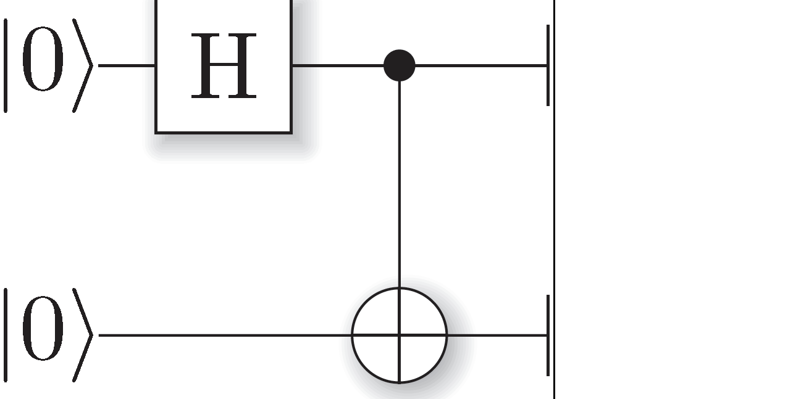
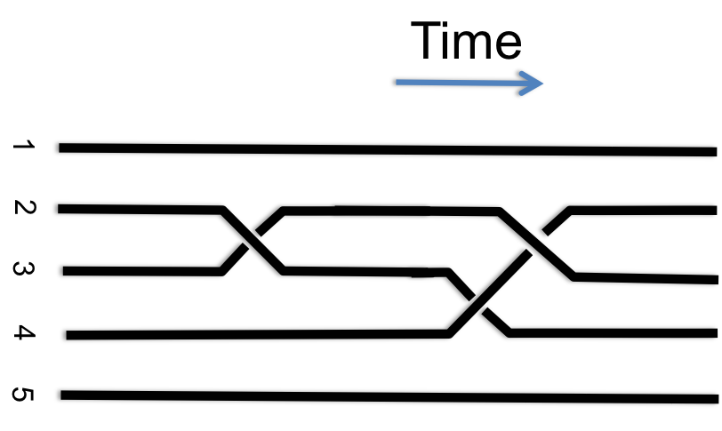
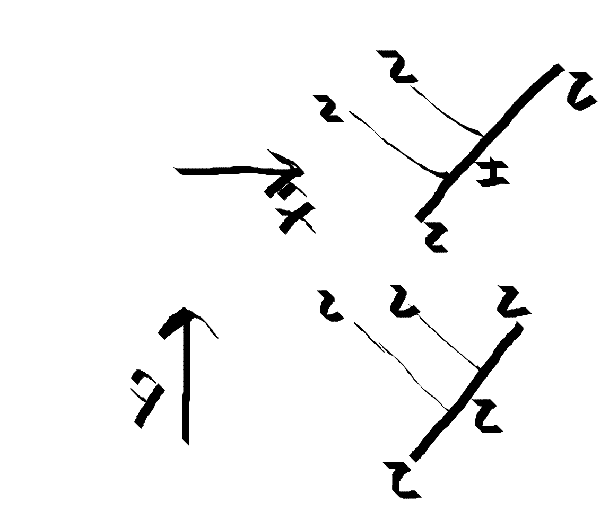
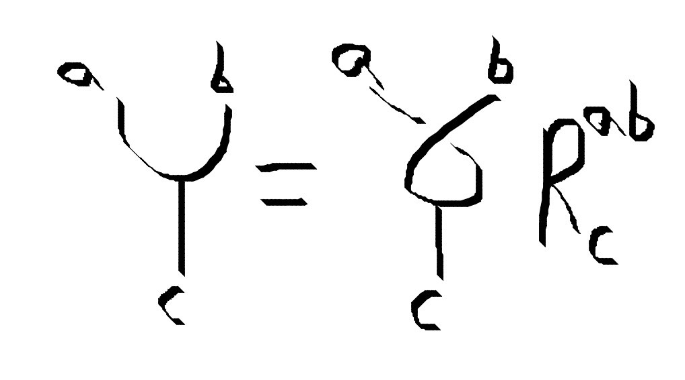
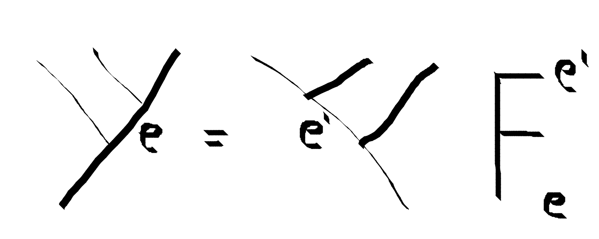
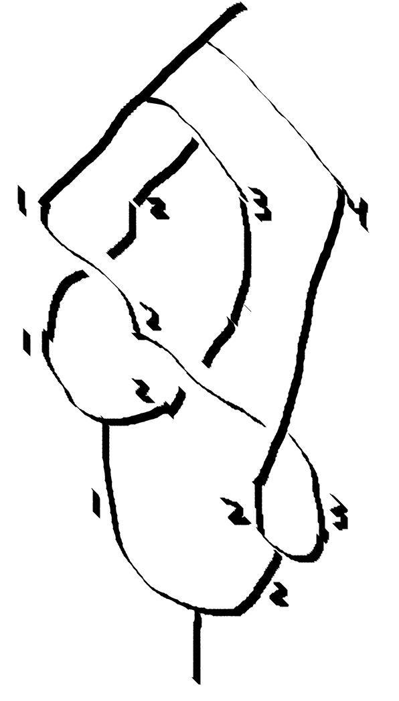

%A Touch of Topological Quantum Computation in Haskell
% Philip Zucker


# Overview
::: notes
Where are we going today:
- Category Theory?
:::

- Quantum Computation
  + Quantum Mechanics
  + Topological Quantum Computation
  + Anyons
- Haskell
  + Dense Vectors
  + Sparse Vectors
  + Linear Monad
  + Implementing Fibonacci Anyons


# Quantum Computation
::: notes

- Hard to keep Quantum Quantum. 
- Topological Quantum Computation
{ width=50% } { width=50% }
:::

- Use Quantum Mechanics to Solve Problems Fast
- Applications 
   + Cryptography
   + Optimization
   + Physical Simulations


# Quantum Mechanics in 5 Minutes
::: notes

What makes quantum powerful  negative numbers
Probability has superposition and entanglement

We're trying to tread vast vistas today, so I'm going to go for the fastest explanation I can.
We are all familiar with the notion of probability

Vectors are a unifying notion for many proeprtes


discrete states - metnotion that

$T_{ij} = P(i | j)$            $U = e^{\frac{iHt}{\hbar}}$


$\sum_i T_{ij} = 1$            $U^\dagger U = I$

$\sum_i p_i = 1$               $\sum_i |\psi_i|^2 =1$
:::

--------------------------
Probability                    Quantum          
-----------                    -------          
familiar                       magic 


$S \rightarrow [0,1]$          $S \rightarrow \mathbb{C}$

$p_i$                          $\psi_i$

$T_{ij} = P(i | j)$            $U_{ij} = e^{\frac{iHt}{\hbar}}$

$d^n$ scaling                  $d^n$ scaling


sampling                       measurement


----------------------


#  Topological Quantum Computation Anyons
::: notes

Have a diagram of each junction type

need a picture


Productions rules like chemistry, or ncuealr physics. Werido conserved quantities
Charge

mention Hopf algebras? Nope.

grab a table of the fibonacci anyon rules.
- Production rules give possible Tree Nodes
:::
- Core Abstraction for Topological Quantum Computation
- Anyons are peculiar particles
- Production Rules $N_{ab}^c$
  + Similar to chemistry or nuclear.
- Quantum Vector Space 
   + Number and Types of particles.


# Fibonacci Anyons

- Fibonacci Anyons
  + Simple
  + Universal Quantum Computation
- Two particle types: 
  + $\tau$
  + $I$
- one nontrivial production: 
  + $\tau \rightarrow \tau \tau$


# Basis

- Choice of basis = Production Tree Shape

{ width=50% }

# Basis Vector
- Basis Vector = Interior Tree Labelling 

{ width=50% }

# Computation Using Anyons
::: notes

- Reassociating = Change of Basis

:::
- Use subspace of anyon space as qubits
- Gates built using braiding

{ width=50% } { width=50% }

# Computation Using Anyons (Cont.)

- Linear maps
   + Braiding = Physical Process. 
     { width=50% } 
   + Reassociating = Change of Basis
     { width=50% }

# How do I implement this monster on a computer I have?
::: notes

Well tough problems call for tough answers.

:::
{ width=100% }

# Haskell
::: notes
Before we get into that, let's take am oment to talk about Haskell

The runtime model is mathemtical functions. y =x^2 makes no says to say set x=7. Or to have internal state
x = 2
x = 3
Is nonsense

Maybe lose it?


I'm sorry to say that if you don't know haskell, you still won't after I'm done speaking, but I hope
it is  still understandable at the psuedo code level

 intuitive language model
 - Lazily evaluated
:::

- Typed Functional Programming Language
- Since 1990
- Optimizing Compiler
- Pure 
- Polymorphic

```haskell
factorial :: (Eq a, Num a) => a -> a
factorial 0 = 1
factorial n = n * (factorial (n-1))
```

# Dense Vectors 
::: notes

Why do we make everything implciit, only in the mind of the programmer
The dream is to make everything explicit in a pain free manner
That the language is helps you think, and helps to make sure you are making sense
The compiler/ types are your friend. Not your enemmy not a disciplinarian
, available for the compiler to check


for many scientific applications
crashing isn't the primary concern really

Integer indexing. programs for computers vs humans 

:::

- Arrays
  + `[a]`
  + `Vector a`

- Types as Intent and Design
  + `data V4 a = V4 a a a a`
  + `Vec 7 a`

# Free Vectors
::: notes
- Make the type of the index part of the vector
:::

- You can make a vector space from any set.
- Explicit type for index/basis
  + Plays elegantly with Haskell
  + `b -> r`
  + `Map b r`
  + `[(b,r)]`
- Similar to Sparse Vectors

# Generalized Abstract Data Types (GADTs) for Anyon Trees
::: notes

- Particles $I$ and $\tau$

Generalized Abstract Data Types
Haskell Extension that let's you pick a signature for your constructors.
Constructors are special function in that they are universal. The GADT maintains this universailty.
You don't lose type information by applying a GADT constructor. It is recoverable via pattern matching.


We can constrain our tree type using GADTs.

Why did I do it this way.
I wanted to hold the type representing the basis we're alking about
The constructor

Have a diagram of each junction type

- Particles $I$ and $\tau$
- Possible production rules:
type Fib
```haskell
data Tau
data Id
```

:::


```haskell
data FibTree root leaves where
      TTT :: FibTree Tau l -> FibTree Tau r 
                           -> FibTree Tau (l,r)
      ITT :: FibTree Tau l -> FibTree Tau r 
                           -> FibTree Id (l,r) 
      TIT :: FibTree Id  l -> FibTree Tau r 
                           -> FibTree Tau (l,r)
      TTI :: FibTree Tau l -> FibTree Id r 
                           -> FibTree Tau (l,r)
      III :: FibTree Id  l -> FibTree Id r 
                           -> FibTree Id (l,r)
      TLeaf :: FibTree Tau Tau
      ILeaf :: FibTree Id Id
```

```haskell
exampleTree :: FibTree Tau (Tau,(Tau,Tau))
exampleTree = TTI (TLeaf) (ITT TLeaf TLeaf)
```


# Implementing Linear Maps

::: notes
Explciit matrix is very useful for inversion, other operations.
But if the only thing you're going to do is matrix multiplication or
matrix vector multiply, the functional representation is flexbiel
identity matrix = id
How do you know you are not squaring

$A(\alpha \vec{x} + \beta \vec{y}) = \alpha A \vec{x} +\beta A \vec{y}$
don't have a seperate slide on

Defining how linear maps act on a basis define how they act on any vector via linearity.

Hmm. I have a mixed message here
I say functions suck because they have only one interface, evaluatation

In

  + Bad for anything except Matrix-Vector product.

:::

 
- Matrices
  + `[[r]]`
  + `V4 (V4 r)`
  + `[((b,b),r)]`
- What about `(Vec a -> Vec a)`?
  + Excellent fit with Haskell
  + Possibly very fast and flexible.

```haskell
vfun :: Vec Double -> Vec Double
vfun = fmap square
```

# The Linear Monad
::: notes
Sorry. I HAD TO
Is Pipework good enough?
Allows lifting of injectiton, projection, and permutation functors
Guarantees we cannot do nonlinear operations
Linear functions are an interesting subset that are very useful.
But how do we constrain this
Vec Double -> Vec Double 
can easily be non linear
piponi

The vector considered as a functor over the basis labels, not the scalars.
a -> m b should be viewed as a -m> b

linear functions are often described as their action on basis elements
And the extended to an arbitrary vector by linearity.

pure indexful functions can be lifted with fmap


Giry monad? Other names?

For the purspoes of today, a monad is a pattern to abstract out common pipework happening between functions
If you want to always check for errors, then the type system should force you to
If a function can return a null value 

It is repetitive
Linear functions are the same way. The distribution of the linear function is pipework that will occur between
ever function call.

```haskell
matA Up   = [(Up,1)  ,  (Down,  1)]
matA Down = [(Up,1)  ,  (Down, -1)]
```
$A\hat{e}_i = \sum_j a_{ij}\hat{e}_j$

```haskell 
instance Num b => Monad (W b) where
   return x = W [(x,1)]
   l >>= f = W $ concatMap (\(W d,p) -> map (\(x,q)->(x,p*q)) d) (runW $ fmap f l)
bs >>= f = [  |  (b, r) <- bs] 
pure
```

Monads are also used for things that aren't (immediate) problems in less principled languages
State threading
Mutation


:::

- Monad pattern abstract away repetitive pipework
  + Null checking
  + Error handling
- Vectors as a monad over the index type.
- $A (\alpha \hat{x} + \beta \hat{y}) = \alpha (A \hat{x}) + \beta (A \hat{y})$

```haskell
newtype Q b = Q [(b, Complex Double)]
flip (>>=) :: (b -> Q a) -> (Q b -> Q a)
return :: b -> Q b
```


# Braiding & ReAssociation

```haskell
braid :: FibTree a (l,r) -> Q (FibTree a (r,l))
braid (ITT l r) = W [(ITT r l,  cis $ 4 * pi / 5)] 
braid (TTT l r) = W [(TTT r l,  (cis $ - 3 * pi / 5))]
braid (TTI l r) = pure $ TIT r l
braid (TIT l r) = pure $ TTI r l
braid (III l r) = pure $ III r l
```

- Reassocation is similar

```haskell
fmove :: FibTree a (c,(d,e)) -> Q (FibTree a ((c,d),e))
```

# Final Thoughts

- Greedy pursuit of performance is mind closing
- Types are good
  + Good For Design
  + Good For Safety
- Haskell is Good
  + Useful in scientific contexts.
- Further Work
  + Category Theory for Anyons
  + 2Vect
  + Actually emulating an algorithm

# Thank You

## References 

- http://www.philipzucker.com/a-touch-of-topological-quantum-computation-in-haskell-pt-i/
- http://www.philipzucker.com/a-touch-of-topological-quantum-computation-in-haskell-pt-ii-automating-drudgery/
- http://www.philipzucker.com/a-touch-of-topological-computation-3-categorical-interlude/
- http://www.theory.caltech.edu/people/preskill/ph229/
- http://blog.sigfpe.com/2007/03/monads-vector-spaces-and-quantum.html

